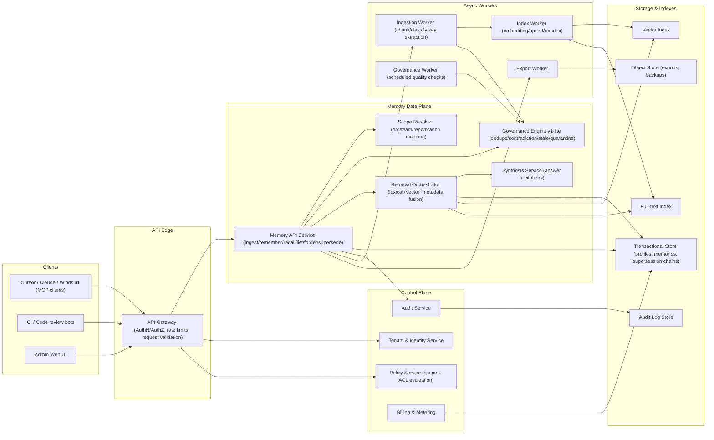

# JustMemory — Company-Wide Agent Memory PRD

**Version:** v1.1  
**Date:** 2026-04-25  
**Status:** Draft for review  
**Owner:** Founder / Product  
**Audience:** Product, Engineering, Design, GTM

---

## 1) Product summary

A centralized, hosted memory service that lets teams share durable memory across coding agents (Cursor, Claude, Windsurf, CI review bots) so agents retain organizational knowledge over time.

The product turns ephemeral agent context into a governed company asset: searchable, scoped, auditable, and continuously improving.

---

## 2) Problem statement

Teams using coding agents face:

- Manual, one-file context management does not scale. Many teams distribute a single global file (for example `CLAUDE.md`) to all devices; updates flow through one maintainer, and that same broad context is injected into most sessions. This creates bottlenecks, stale or uneven context, irrelevant prompt injection, higher token usage, and lower output quality.
- Session amnesia (agents forget prior decisions)
- Tool silos (memory stuck in one IDE or vendor)
- Repeated mistakes (same review comments and architecture errors recur)
- Context setup overhead (manual docs and priming every session)
- Lack of governance (unclear ownership, provenance, and lifecycle of what agents “know”)

---

## 3) Goals and non-goals

### Goals (v1)

- Shared team memory across multiple agent clients
- High-quality retrieval for coding workflows
- Memory lifecycle with supersession and version history
- Enterprise-ready controls: SSO, RBAC, audit logs, retention, export
- Two flagship use cases:
  1. Coding agent memory for teams
  2. Agentic code review memory

### Non-goals (v1)

- “Support every MCP server or tool in existence” (no universal MCP marketplace in v1)
- Full enterprise workflow orchestration beyond memory + light governance
- Generic RAG or document search replacement (docs may complement, not define the product)
- Autonomous code execution platform

---

## 4) Target users and ICP

### Primary ICP (initial)

- 20–300 engineer companies with heavy AI coding tool usage
- Platform teams and engineering managers under security or compliance pressure
- Multi-tool orgs (e.g. Cursor + Claude + CI agents)

### Personas

- **Engineer (daily user):** less context setup, fewer repeated mistakes
- **Tech lead:** architectural consistency, less review churn
- **Platform / security buyer:** governance, auditability, access control
- **AI tooling owner:** one memory layer across agents and CI

---

## 5) Key use cases

### UC1: Team coding memory

- An agent in one tool recalls project conventions, dependency choices, and past decisions
- Another teammate’s agent in a different tool reads the same memory profile
- New engineers and agents onboard without re-deriving tribal knowledge

### UC2: Agentic code review memory

- Review bot remembers previously dismissed false positives
- Bot remembers accepted exceptions and recurring codebase patterns
- Review noise decreases over time while useful signal stays high

---

## 6) Product principles

- Memory as infrastructure, not a raw transcript archive
- Constrained APIs (ingest, remember, recall, list, forget, supersede) over open-ended storage
- **Latest truth with full history** via supersession (new memory replaces active truth; prior versions remain auditable)
- Scoped by default (least surprise, least leakage)
- Portable data: export and clear provenance to reduce lock-in fear

---

## 7) Functional requirements (v1)

### 7.1 Memory profile model

- Create, read, update, delete memory profiles
- Profile scopes: `org > team > project/repo` (optional branch or environment tag)
- Profiles shared across users and agents according to permissions
- **Default access policy:** profiles are org-readable by default, but only the owning team can write.
- **Configurable overrides:** admins can change read policy per profile/namespace (`org`, `selected_teams`, `private`) and write policy (`owner_team`, `owner_plus_delegates`).
- **Sensitive namespace guardrails:** security/compliance/incident namespaces default to restricted read and stricter write approval.

### 7.2 Core memory operations

- `ingest(messages, metadata)` — bulk ingestion (typically at compaction or session boundary)
- `remember(item, metadata)` — explicit write
- `recall(query, scope)` — retrieval plus synthesized answer plus evidence
- `list(filters)` — inspection and debugging
- `forget(id)` — mark inactive or tombstone per policy
- `supersede(old_id, new_item)` — versioned replacement with forward and backward links

### 7.3 Memory types

- **Fact** — stable truth (subject to supersession)
- **Event** — time-bound change
- **Instruction** — procedure or convention
- **Task** — short-lived active work; may be excluded from heavy indexing by default

### 7.4 Retrieval

- Hybrid retrieval: at minimum lexical + vector + metadata filters
- Ranking, deduplication, and recency-aware tie-breaking
- Response includes: synthesized answer, cited memory items, basic confidence or quality score

### 7.5 Governance and admin

- SSO / SAML (Business tier and above)
- RBAC: e.g. admin, editor, reader, agent (least privilege for automated writers)
- Audit log: create, read, update, delete, supersede, export
- Retention policies and TTL for selected types
- Export API (JSON or NDJSON)

### 7.6 Integrations

- MCP server for IDE-resident agents
- REST API for CI and review bots
- Initial focus: Cursor, Claude-family clients where MCP is viable, Windsurf-compatible flows, GitHub PR metadata for review memory

---

## 8) Memory governance engine (v1-lite)

A **policy and quality layer** that runs on every write and on a schedule. It is not a separate “chat agent” in v1; it is deterministic rules plus small model-assisted checks where cost and latency allow.

### 8.1 Responsibilities

- **Duplicate detection** — near-duplicate merges or links; suggest merge instead of silent overwrite
- **Contradiction detection** — flag new facts that conflict with active facts in the same scope and key
- **Stale detection** — TTL, repo/branch mismatch, or explicit expiry signals
- **Quarantine** — hold low-trust or high-risk writes until reviewed (configurable)
- **Supersession suggestions** — propose `supersede` with rationale; optional auto-apply for low-risk keys only

### 8.2 Human and policy gates

- Sensitive namespaces (e.g. security, compliance, production infra) require approval or stricter auto-rules
- Review queue in admin UI: approve, reject, merge, supersede

### 8.3 Success criteria for v1-lite

- Measurable drop in “junk” or duplicate memories per profile per week
- Zero silent cross-scope application of memories (all writes attributed and scoped)

---

## 9) Memory steward agent (v2 — later)

A **dedicated agent or service** that continuously improves memory quality as corpora grow.

### 9.1 Capabilities (post-MVP)

- Periodic audits: drift, stale chains, orphaned events, over-indexed tasks
- Batch proposals: merge duplicates, archive stale, split overloaded facts
- Per-profile **health score** and dashboards for admins
- Optional auto-execution for low-risk operations under strict guardrails

### 9.2 Why later

- Requires stable telemetry from v1 (write sources, recall usage, human overrides)
- Higher model and operations cost; clearer ROI once paying customers exist

---

## 10) Non-functional requirements

- **Availability:** 99.9% target for Business tier
- **Latency:** p95 recall under ~1.5s for typical profile sizes (tune with customer data)
- **Isolation:** strict multi-tenant separation
- **Security:** TLS in transit; secrets handling; least-privilege services
- **Observability:** tracing and per-request diagnostics for recall and ingest
- **Data portability:** full profile export on demand

---

## 11) UX requirements

### 11.1 Developer UX

- Minimal MCP setup; obvious profile and scope selection
- Explainable recall: citations and short “why retrieved” rationale

### 11.2 Admin UX

- Memory explorer: search, filter, edit, supersede, quarantine
- Governance queue for flagged items
- Activity and quality dashboard (writes, recalls, governance actions, error rates)

---

## 12) Success metrics

### Product KPIs

- Weekly active profiles
- Daily recall requests per active team
- Memory reuse rate (fraction of recalls tied to prior sessions)

### Outcome KPIs

- Reduction in repeated review comments (per repo or team)
- Reduction in manual context priming time (self-reported + time-bounded studies)
- Faster onboarding for new engineers using agents (qual + quant)

### Quality KPIs

- Precision at k on internal eval sets
- Supersession and contradiction queue depth and resolution time
- Rate of user-reported “wrong memory” incidents

### Business KPIs

- Team-to-paid conversion
- Net revenue retention
- Expansion (profiles, seats, usage)

---

## 13) Pricing and packaging (initial)

### Free / Starter

- Limited profiles, memories, and API quotas
- Basic governance (dedupe + light quarantine optional)

### Team

- Shared profiles, hybrid retrieval, admin explorer
- Standard API limits and email support

### Business

- SSO / SAML, full RBAC, audit logs, retention policies
- Higher limits, priority support, SLA target

### Enterprise

- Advanced compliance packaging, data residency options, premium support
- Optional dedicated or VPC-style deployment **if** product strategy includes it (separate technical spike)

---

## 13.1) Open core strategy and feature boundary

JustMemory follows an open core model: a strong self-hostable OSS core for adoption, plus paid cloud and enterprise layers for governance, scale, and compliance.

### OSS core vs commercial boundary

| Capability | OSS Core (self-host) | Cloud / Business | Enterprise |
|------------|-----------------------|------------------|------------|
| Core memory APIs (`ingest`, `remember`, `recall`, `list`, `forget`, `supersede`) | Yes | Yes | Yes |
| MCP + REST interfaces | Yes | Yes | Yes |
| Memory types + supersession chains | Yes | Yes | Yes |
| Hybrid retrieval (baseline lexical + vector + metadata) | Yes | Yes | Yes |
| Basic single-tenant admin UI / CLI | Yes | Yes | Yes |
| Import / export | Yes | Yes | Yes |
| Multi-tenant org control plane | No | Yes | Yes |
| Hosted operations (managed backups, reliability, upgrades) | No | Yes | Yes |
| SSO / SAML + advanced RBAC | No | Yes | Yes |
| Audit logs + retention policy engine | No | Yes | Yes |
| Governance queue with approval workflows | Limited | Yes | Yes |
| Advanced governance rules and quality dashboards | No | Yes | Yes |
| SLA and priority support | No | Yes | Yes |
| Data residency options and custom compliance packaging | No | No | Yes |
| Dedicated/VPC-style deployment option (if offered) | No | No | Yes |

### Packaging principles

- Keep OSS genuinely useful for individual teams and self-hosted adopters.
- Monetize on governance, multi-tenant control, compliance, and managed operations.
- Avoid withholding core developer value (memory primitives and integrations) from OSS.
- Preserve clear upgrade path from OSS -> Cloud -> Enterprise without forcing rewrites.

---

## 14) Risks and mitigations

| Risk | Mitigation |
|------|------------|
| Memory quality degrades as corpus grows | Governance engine v1-lite; steward agent v2; supersession |
| Cross-scope leakage | Strict metadata filters, integration tests, policy engine |
| MCP client fragmentation | Conformance tests, documented transports, clear error surfaces |
| Commodity “memory API” perception | Code-review memory + governance + workflow-native metadata |
| Trust and lock-in concerns | Export, provenance, transparent audit trail |

---

## 15) Roadmap

### Phase 0 (0–4 weeks): design partner alpha

- 3–5 teams, manual onboarding
- Profiles + ingest / remember / recall + basic audit
- Governance v1-lite: dedupe, contradiction flagging, quarantine (minimal UI)

### Phase 1 (4–10 weeks): MVP beta

- Stable MCP + REST
- Supersession chains and admin explorer
- Team coding memory workflow complete
- GitHub-oriented review bot integration (basic)

### Phase 2 (10–16 weeks): business readiness

- SSO / RBAC hardening
- Billing and usage metering
- Quality dashboard for governance outcomes

### Phase 3 (post-v1)

- Memory steward agent (v2)
- Branch-aware promotion, deeper compliance packages, more connectors

---

## 16) Open questions

1. Default sharing unit: team-level vs repo-level profile?
2. Should **task** memories be fully indexed or query-only?
3. How aggressive is auto-supersession vs human approval by memory class?
4. First GTM wedge: code review memory vs team coding memory (can run two tracks with one backend)?
5. Which compliance artifacts are required for the first ten paying customers (SOC2 path, DPA, etc.)?

---

## 17) MVP definition of done

MVP is complete when:

- At least two distinct agent clients can attach to one shared profile and recall consistently
- Ingest + recall work across sessions with supersession and visible history
- Code review integration shows measurable reduction in repeated noisy feedback in pilot repos
- Admins can audit reads/writes and export a full profile
- Governance v1-lite flags duplicates and contradictions into a review queue without blocking all writes by default

---

## 18) System architecture and service boundaries

This section defines the concrete runtime architecture for JustMemory v1 and the ownership boundaries between services.

### 18.1 High-level architecture diagram

### 18.2 Service boundaries (ownership and responsibilities)

#### API Gateway
- Terminates client auth and enforces baseline request controls.
- Routes traffic to Memory API and control-plane endpoints.
- Does not contain business logic for memory quality or retrieval.

#### Tenant & Identity Service
- Manages orgs, teams, users, service accounts, and role bindings.
- Issues and validates identity claims consumed by policy checks.
- Source of truth for principal-to-team relationships.

#### Policy Service
- Evaluates read/write actions against profile policies and namespace guardrails.
- Enforces default policy: org-readable, owner-team write.
- Returns allow/deny plus effective scope set for query execution.

#### Memory API Service
- Authoritative entry point for memory lifecycle APIs.
- Coordinates write path, retrieval path, export path, and supersession actions.
- Owns API contracts for MCP and REST.

#### Scope Resolver
- Resolves target profiles/scopes from explicit profile IDs and metadata (repo/team/branch).
- Handles ambiguity using deterministic fallback rules (quarantine or deny).
- Never performs authorization decisions; delegates to Policy Service.

#### Governance Engine v1-lite
- Runs deterministic and model-assisted checks for duplicate, contradiction, stale, and quarantine decisions.
- Produces review queue items and supersession recommendations.
- Does not mutate sensitive memories without policy-approved action.

#### Retrieval Orchestrator
- Executes lexical/vector/metadata retrieval channels in parallel.
- Fuses and ranks candidates, applies recency and scope constraints.
- Invokes synthesis only on top-ranked evidence.

#### Synthesis Service
- Produces concise recall answer grounded in retrieved evidence.
- Must return supporting citations and confidence metadata.
- No direct write access to memory storage.

#### Audit Service
- Persists immutable audit events for reads, writes, policy decisions, exports, and governance actions.
- Supports compliance queries and admin views.

#### Async Workers
- Ingestion worker: normalization/chunking/classification/key extraction.
- Index worker: embedding generation and index maintenance.
- Governance worker: scheduled quality scans and drift checks.
- Export worker: profile export bundles and long-running data jobs.

### 18.3 Data contracts (minimum)

#### Memory record
- `memory_id`, `org_id`, `profile_id`, `team_id`, `scope_type`
- `memory_type` (`fact|event|instruction|task`)
- `content`, `topic_key`, `status` (`active|superseded|inactive|quarantined`)
- `supersedes_id`, `superseded_by_id`
- `source_actor`, `source_client`, `source_repo`, `source_pr`, `source_session`
- `created_at`, `updated_at`, `expires_at`, `confidence`, `labels`

#### Profile record
- `profile_id`, `org_id`, `owner_team_id`, `scope_path`
- `read_policy`, `write_policy`, `sensitive_namespace_flag`
- `retention_policy`, `created_at`, `updated_at`

#### Audit event
- `event_id`, `event_type`, `actor_id`, `org_id`, `profile_id`
- `resource_id`, `action_result`, `policy_decision`, `reason`
- `request_id`, `timestamp`, `metadata`

### 18.4 Request flows (reference)

#### Write flow (`remember` / `ingest`)
1. Gateway authenticates caller and forwards identity claims.
2. Memory API calls Scope Resolver for target scope candidates.
3. Policy Service returns allowed write scopes (or deny).
4. Memory API persists initial write request and enqueues ingestion worker.
5. Governance Engine runs checks (duplicate, contradiction, stale, quarantine).
6. Memory status is set (`active` or `quarantined`), indexes updated asynchronously.
7. Audit event emitted for each decision step.

#### Recall flow (`recall`)
1. Gateway authenticates caller.
2. Policy Service computes effective readable profile set.
3. Retrieval Orchestrator queries lexical/vector/metadata channels constrained by scope.
4. Ranked candidates passed to Synthesis Service.
5. Response returns answer + citations + confidence + request ID.
6. Audit event emitted with profiles accessed and decision trace.

### 18.5 Boundary rules (explicit)

- Authorization is always externalized to Policy Service; no service bypass.
- Retrieval never crosses profile boundaries not returned by policy.
- Synthesis service is read-only and cannot write/modify memory state.
- Governance recommendations require policy-allowed mutation paths.
- Export jobs are profile-scoped and fully auditable.
- All cross-service calls include `request_id` for traceability.

### 18.6 Deployment model (v1 target)

- Stateless API/control-plane services deployed horizontally.
- Transactional store and indexes managed as regional services with backups.
- Async workers run on queue-based autoscaling.
- Separate staging and production with compatibility tests for MCP/REST clients.
- Feature flags for governance heuristics and retrieval tuning.

---

