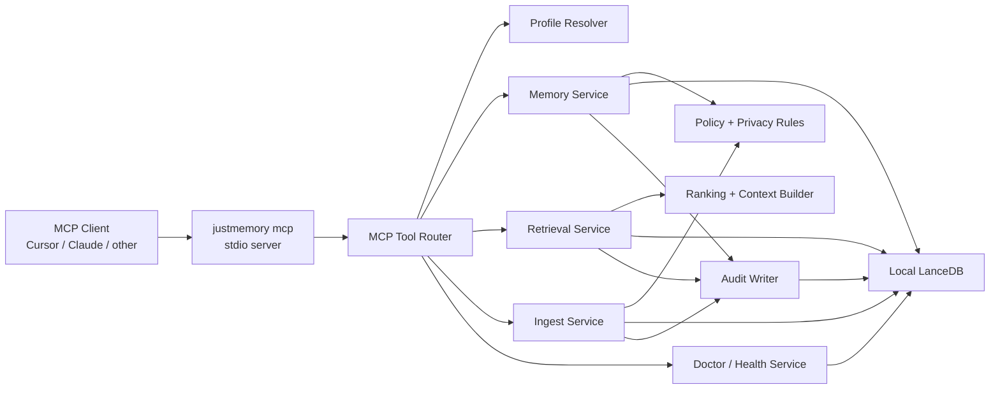

# JustMemory Local Backend PRD / Spec

**Version:** v0.1  
**Date:** 2026-04-25  
**Status:** Draft for backend implementation planning  
**Owner:** CTO  
**Audience:** Backend engineering, MCP implementers, agent harness authors  
**Related docs:** `VISION.md`, `docs/PRD-company-wide-agent-memory-v1.1.md`, `docs/MCP-facing-agent-contract.md`

**Implementation status (2026-04-27):** Alpha Slice 1 plus major parts of Phases 2, 4, and 7 are implemented in-repo as the `justmemory` package (`npm run build` / `justmemory mcp`): MCP tools for capabilities, health, setup explanation, profiles, remember/get/**list**/recall, session start/end, and ingest status; MCP prompts (`start_coding_session`, `recall_context`, `session_handoff`); behavioral tool descriptions; implicit session creation for recall/remember paths when explicit session start is not called; profiles and memories persisted under `JUSTMEMORY_HOME` (default `~/.justmemory`) in LanceDB; serialized writes via a DB mutex; append-only **audit** rows for selected tools; idempotent startup migrations tracked in LanceDB (`schema_migrations`) with `last_applied_migration_id` / `store_schema_version` mirrored into `config.json`; and installer foundations via `justmemory mcp install <client>` for Cursor, Claude Code, Claude Desktop snippet output, and generic MCP config generation.

---

## 1) Product Summary

JustMemory v0.1 is a local-only backend for durable agent memory. It runs on the developer's machine, exposes the MCP tool surface defined in `docs/MCP-facing-agent-contract.md`, and stores all persistent data in a local LanceDB database.

The first version exists to prove the core developer workflow before any hosted control plane: an agent can connect through MCP, resolve a local profile, remember useful facts, recall them later with citations, and inspect or correct memory without login, Docker, or external services.

---

## 2) Problem Statement

Coding agents lose useful context between sessions. Developers compensate with manual notes, copied prompts, project docs, and repeated setup instructions. That works poorly even for one person:

- Important project decisions are scattered across chats and files.
- Agents repeat mistakes that were already corrected.
- Context priming consumes time and tokens every session.
- Existing memory experiments are hard to inspect, debug, or trust.

For v0.1, JustMemory should solve this locally first. The system should feel like a small, reliable piece of developer infrastructure that an MCP client can start and use immediately.

---

## 3) Goals

- Provide a local backend that MCP clients can connect to through `justmemory mcp`.
- Use LanceDB as the local persistent database for profiles, memories, source records, sessions, jobs, feedback, and audit events.
- Implement the required local-first subset of the MCP-facing agent contract.
- Support explicit memory writes, session handoff ingestion, recall, inspection, verification, feedback, and local export.
- Keep identity simple: no login, no cloud orgs, no remote synchronization, no multi-tenant control plane.
- Preserve the future hosted architecture boundary by keeping profile, scope, policy, audit, and retrieval concepts explicit.

---

## 4) Non-Goals

- Hosted team memory, cloud sync, remote admin UI, billing, SSO, SAML, service accounts, or enterprise policy.
- Multi-user organization isolation beyond local profile boundaries.
- Background daemon architecture. The MCP server is started by the MCP client as a local process.
- Heavy model-assisted governance. v0.1 uses deterministic validation, redaction, dedupe, and lifecycle rules.
- Full source transcript retention by default. Source records are supported, but raw message storage must be configurable and conservative.
- Replacing project documentation or code search. JustMemory stores distilled agent memory and lightweight source provenance, not an entire repo index.

---

## 5) Target User

The v0.1 user is a solo developer or founder using Cursor or another MCP-capable coding agent locally.

The successful first-run story:

1. Install the package.
2. Register the MCP server with a client.
3. Start a coding session in a repo.
4. Ask the agent to recall prior project context.
5. Save a correction or durable project decision.
6. Start a later session and see that memory returned with evidence.

---

## 6) Local Runtime Requirements

### 6.1 Package and Entrypoints

The backend ships as the `justmemory` npm package.

Required commands:

- `justmemory mcp`: starts the stdio MCP server.
- `justmemory mcp install <client>`: writes or guides local MCP client configuration.
- `justmemory doctor`: validates local database, MCP registration, profile resolution, and sandbox write behavior.
- `justmemory export`: exports local data to JSON or NDJSON.
- `justmemory profiles`: lists, creates, selects, and inspects local profiles.

### 6.2 Local Data Directory

Default data directory:

```text
~/.justmemory/
```

Required contents:

```text
~/.justmemory/
  config.json
  lancedb/
  exports/
  logs/
```

`config.json` stores process-level settings such as default profile, embedding provider choice, privacy defaults, and client install metadata. LanceDB remains the persistent database for product data.

### 6.3 Process Model

- The MCP client starts `justmemory mcp` as a stdio child process.
- v0.1 does not require a daemon or separate database server.
- The backend must support repeated short-lived MCP server processes against the same local data directory.
- Writes must use a local lock to prevent concurrent corruption when multiple clients start separate MCP server processes.
- If the database lock is held, read-only tools may continue when safe; mutating tools return `backend_degraded` with an actionable message if a safe write cannot be obtained.

---

## 7) MCP Boundary

`docs/MCP-facing-agent-contract.md` is the public contract. This backend spec defines the first local implementation of that contract.

### 7.1 Required v0.1 Tools

The local backend must implement:

- `memory_capabilities`
- `memory_health`
- `memory_profiles_list`
- `memory_profile_current`
- `memory_profile_select`
- `memory_explain_setup`
- `memory_session_start`
- `memory_session_end`
- `memory_context`
- `memory_recall`
- `memory_remember`
- `memory_ingest`
- `memory_ingest_status`
- `memory_list`
- `memory_get`
- `memory_verify`
- `memory_timeline`
- `memory_supersede`
- `memory_forget`
- `memory_feedback`

The implementation may mark advanced tools as local-only or experimental in `memory_capabilities`, but the tool names and response envelopes must remain stable.

### 7.2 Required v0.1 Resources

The local backend must expose these MCP resources:

- `justmemory://status`
- `justmemory://setup/explanation`
- `justmemory://current/context`
- `justmemory://profiles/current`
- `justmemory://profiles/{profile_id}/summary`
- `justmemory://profiles/{profile_id}/latest`
- `justmemory://sessions/{session_id}/summary`

`justmemory://governance/queue-counts` may return zero counts and an explanation that local v0.1 has deterministic governance only.

### 7.3 Required v0.1 Prompts

The local backend should expose these MCP prompts when the MCP SDK supports prompts for the target client:

- `start_coding_session`
- `recall_context`
- `session_handoff`
- `memory_hygiene`
- `test_memory_setup`

`review_memory` is deferred unless PR/review metadata is present in the client request.

---

## 8) Identity, Profiles, and Scope

### 8.1 Identity Mode

v0.1 supports only local identity modes:

- `local_anonymous`: default identity, no login.
- `local_user`: named local identity stored on the machine.

Default principal:

```json
{
  "principal_type": "local",
  "principal_id": "local_default",
  "org_id": "local",
  "roles": ["reader", "editor"],
  "identity_mode": "local_anonymous"
}
```

### 8.2 Local Profile Model

A profile is still the addressable memory container. In v0.1, profiles are local records.

Default profile resolution order:

1. Explicit `profile_id`.
2. Client-persisted profile hint.
3. Workspace path mapping.
4. Git remote URL mapping.
5. Default local profile.
6. `scope_ambiguous` if multiple writable profiles match.

### 8.3 Default Profiles

On first run, the backend creates:

- `local_default`: a general local profile.
- A workspace-specific profile when `memory_session_start` receives a workspace path and no profile mapping exists.

The workspace-specific profile name should derive from the repo or folder name, for example `agent-investigation-memory`.

### 8.4 Local Policy

Policy is intentionally simple:

- The local principal can read and write local profiles.
- Sensitive namespaces are allowed, but writes may be blocked or redacted based on deterministic local rules.
- Sandbox writes go to namespace `_sandbox`.
- Profile boundaries must still be enforced so future hosted mode does not require a contract rewrite.

---

## 9) LanceDB Storage Model

LanceDB is the local product database. v0.1 should use explicit tables rather than opaque blobs so inspection, export, and future migration stay straightforward.

### 9.1 Tables

#### `profiles`

Stores local profile records.

Minimum columns:

- `profile_id`
- `name`
- `scope_path`
- `workspace_paths`
- `repo_urls`
- `default_namespace`
- `read_policy`
- `write_policy`
- `retention_policy`
- `created_at`
- `updated_at`
- `last_activity_at`

#### `memories`

Stores authoritative memory records and vector embeddings.

Minimum columns:

- `memory_id`
- `profile_id`
- `namespace`
- `memory_type`
- `status`
- `content`
- `content_hash`
- `topic_key`
- `labels`
- `importance`
- `confidence`
- `embedding`
- `embedding_model`
- `indexing_state`
- `write_state`
- `supersedes_id`
- `superseded_by_id`
- `source_ids`
- `source_actor`
- `source_client`
- `source_session`
- `source_repo`
- `source_branch`
- `source_pr`
- `file_paths`
- `redaction_state`
- `expires_at`
- `created_at`
- `updated_at`

#### `sources`

Stores optional source records and excerpts.

Minimum columns:

- `source_id`
- `profile_id`
- `source_type`
- `source_actor`
- `source_client`
- `source_session`
- `content`
- `content_hash`
- `redaction_state`
- `retention_policy`
- `metadata`
- `created_at`

#### `sessions`

Stores session start, checkpoint, and handoff state.

Minimum columns:

- `session_id`
- `profile_id`
- `client`
- `workspace`
- `repo`
- `branch`
- `status`
- `started_at`
- `ended_at`
- `summary`
- `handoff_summary`
- `metadata`

#### `ingest_jobs`

Tracks async or staged ingestion work.

Minimum columns:

- `ingest_job_id`
- `profile_id`
- `session_id`
- `status`
- `input_hash`
- `accepted`
- `rejected`
- `extracted_count`
- `active_count`
- `quarantined_count`
- `duplicate_count`
- `superseded_count`
- `warnings`
- `created_at`
- `updated_at`

#### `feedback`

Stores local memory feedback.

Minimum columns:

- `feedback_id`
- `memory_id`
- `profile_id`
- `feedback_type`
- `comment`
- `replacement_content`
- `action_taken`
- `review_required`
- `created_at`

#### `audit_events`

Stores local audit events for traceability and debugging.

Minimum columns:

- `event_id`
- `request_id`
- `event_type`
- `actor_id`
- `profile_id`
- `resource_id`
- `action_result`
- `policy_decision`
- `reason`
- `metadata`
- `created_at`

### 9.2 Authoritative Store Rule

The `memories` table is the authoritative memory record store. Search indexes, profile summaries, context blocks, and exports are derived from these records.

Required guarantees:

- `memory_get(memory_id)` can read an accepted memory immediately.
- `memory_list` can inspect accepted records immediately.
- `memory_recall` may lag if `indexing_state` is not `ready`.
- Superseded memories remain inspectable but are excluded from current-truth recall by default.

### 9.3 Migrations

The local backend must maintain a schema version record.

Migration requirements:

- Migrations run automatically on startup.
- Migrations are idempotent.
- Failed migrations stop mutating tools and return `backend_degraded`.
- `justmemory export` must work before destructive migrations are attempted.

---

## 10) Retrieval and Indexing

### 10.1 Retrieval Channels

v0.1 supports hybrid retrieval:

- exact `topic_key` match
- metadata filters
- lexical scoring over `content`, `labels`, `namespace`, and source metadata
- vector search through LanceDB when embeddings are available
- recency and importance tie-breaking

### 10.2 Embeddings

The default v0.1 embedding path must be local, cheap-hardware friendly, and usable without external services.

Chosen v0.1 setup:

- Runtime: `@huggingface/transformers` for Node-local feature extraction.
- Model: bundled quantized ONNX `paraphrase-MiniLM-L3-v2` compatible with Transformers.js.
- Output: 384-dimensional normalized embeddings.
- Storage/search: vectors stored in LanceDB and queried through `@lancedb/lancedb`.
- Remote behavior: disabled by default. The runtime must not download models from Hugging Face during normal MCP startup.

Hardware target:

- Runs on CPU.
- Does not require a GPU, Docker, Python environment, database server, or hosted embedding API.
- Works on low-cost machines with 2 GB RAM and one CPU core.
- Keeps the default model small enough for a normal developer-tool install, targeting a quantized model artifact under roughly 25 MB.

Minimum local requirements:

- Node.js 20 LTS or newer.
- 1 CPU core.
- 2 GB system RAM.
- 256 MB free RAM available to the `justmemory mcp` process during first model load.
- 250 MB free disk for the package, bundled model assets, LanceDB data, exports, and logs.
- 64-bit Linux, macOS, or Windows platform supported by `@lancedb/lancedb`.

Recommended local requirements:

- Node.js 22 LTS or newer.
- 2 CPU cores.
- 4 GB system RAM.
- 512 MB free RAM available during larger ingest jobs.
- 500 MB free disk for growth of local memories, source excerpts, exports, and LanceDB indexes.

Degraded-mode requirement:

- On machines below the minimum or when the embedding model cannot load, JustMemory must still start, accept explicit memories, and serve lexical plus metadata recall. Vector retrieval is disabled and reported through `memory_health` rather than failing MCP startup.

Requirements:

- First use must work offline after installation when the default model artifact is already present.
- If the model artifact is not present, setup must offer a clear one-command install or download path and continue with lexical retrieval until embeddings are ready.
- If a local embedding provider is unavailable, writes remain accepted with `indexing_state=partial` or `not_indexed`.
- `memory_health` must explain whether vector retrieval is ready and what fallback retrieval channels are active.
- `memory_capabilities.retrieval_channels` must accurately advertise enabled channels.
- The embedding runtime must run inside the Node package boundary, for example through ONNX/WASM or another no-service local runtime.
- The embedding runtime must set local-only loading, equivalent to `env.allowRemoteModels = false`, and point `env.localModelPath` at the bundled model directory.
- ONNX/WASM runtime assets must resolve from package-local files, not a CDN.

Recommended default:

- Use `paraphrase-MiniLM-L3-v2` first because it is smaller than 6-layer MiniLM models, 384-dimensional, and simple to use with mean pooling plus normalization.
- Keep `all-MiniLM-L6-v2` as the first quality upgrade candidate for users who have more RAM/CPU and want better retrieval quality.
- Keep `bge-small-en-v1.5` as a later quality upgrade candidate, not the v0.1 default, because its retrieval prompt/pooling conventions add setup complexity.
- Store model name, model version, embedding dimension, quantization mode, and artifact checksum in local config.
- Batch embedding jobs during ingest so interactive MCP calls stay responsive.
- Keep lexical and metadata retrieval always available so vector search is an enhancement, not a hard dependency.
- Keep a pluggable embedding provider interface so future hosted or user-supplied providers do not change the MCP contract.

Tradeoff:

- `paraphrase-MiniLM-L3-v2` is the right default for plug-and-play local adoption on weak machines.
- Retrieval quality may be lower than `all-MiniLM-L6-v2` or `bge-small-en-v1.5`, so ranking must blend vector results with lexical, metadata, recency, and explicit topic-key matches rather than trusting vector score alone.

Implementation sketch:

```ts
import { env, pipeline } from "@huggingface/transformers";

env.allowLocalModels = true;
env.allowRemoteModels = false;
env.localModelPath = bundledModelsPath;
env.cacheDir = localCachePath;
env.backends.onnx.wasm.wasmPaths = bundledWasmPath;

const extractor = await pipeline("feature-extraction", "paraphrase-MiniLM-L3-v2");
const output = await extractor(texts, { pooling: "mean", normalize: true });
```

The model directory layout should be owned by the JustMemory package, for example:

```text
models/
  paraphrase-MiniLM-L3-v2/
    config.json
    tokenizer.json
    tokenizer_config.json
    onnx/
      model_quantized.onnx
```

### 10.3 Ranking Rules

Default ranking order:

1. Hard filters: profile, namespace, memory type, status, repo, branch, labels, time range.
2. Exact topic key and explicit ID matches.
3. Combined lexical and vector score.
4. Active status before historical status.
5. Higher importance.
6. More recent `updated_at`.

Recall must return `why_retrieved` and `retrieval_channels_used`.

### 10.4 Context Block Generation

`memory_session_start`, `memory_context`, and `memory_recall(mode=context_block)` generate compact context blocks.

Context block requirements:

- Fit requested `token_budget_mode`.
- Prefer active instructions, stable facts, recent events, and active tasks for the resolved profile.
- Include citations to memory IDs.
- Include warnings for stale, quarantined, partial, or failed indexing records.

---

## 11) Write Path

### 11.1 `memory_remember`

`memory_remember` is the fast explicit write path.

Processing steps:

1. Validate schema, size, memory type, namespace, and profile.
2. Apply privacy and secret scanning.
3. Normalize content and compute `content_hash`.
4. Detect exact or near duplicates within the resolved profile.
5. Detect simple supersession candidates by `topic_key`.
6. Store an authoritative record or return a rejected/dry-run response.
7. Generate or enqueue embedding work.
8. Emit audit event.

Dry-run must run steps 1-5 without mutating `memories`.

### 11.2 `memory_ingest`

`memory_ingest` handles session summaries, compacted messages, and handoff artifacts.

v0.1 ingestion is allowed to be simple:

- `sync_summary` writes the supplied summary as one or more candidate memories.
- `async_full` creates an `ingest_job` and processes locally in the MCP process when possible.
- If the process cannot safely finish async work, the job remains inspectable and can resume on the next MCP startup.

Ingestion must be idempotent using `session_id`, source IDs, source client, input hash, and content hash.

### 11.3 Oversized Content

Default v0.1 policy:

- Reject oversized single memories with `content_too_large`.
- For ingest payloads, chunk into source records and extracted memories when safe.
- Never silently truncate.

### 11.4 Privacy and Redaction

Before persistence, writes must apply deterministic scanning for:

- common API keys and tokens
- private keys
- `.env`-style secrets
- known credential file paths

If sensitive content is detected:

- block by default for obvious secrets
- redact when a safe replacement is possible
- return `redaction_state` and warning metadata

---

## 12) Correction and Lifecycle

### 12.1 Memory Status

Supported statuses:

- `active`
- `superseded`
- `inactive`
- `quarantined`

### 12.2 Supersession

`memory_supersede` creates a new memory and links:

- old `superseded_by_id -> new_memory_id`
- new `supersedes_id -> old_memory_id`

Recall excludes the old memory by default unless history is requested.

### 12.3 Forget

Default `memory_forget` mode marks records `inactive`.

Hard deletion is not part of normal v0.1 MCP use. Local CLI cleanup can be added later, but the MCP tool should preserve auditability.

### 12.4 Feedback

`memory_feedback` stores feedback and may perform deterministic actions:

- `not_relevant`: downrank future recall.
- `stale`: mark as supersession candidate.
- `incorrect`: require explicit replacement before mutation.
- `duplicate`: link or mark duplicate when exact hash match exists.
- `sensitive`: mark quarantined and hide from normal recall.

---

## 13) Observability and Debugging

Every MCP response must include:

- `ok`
- `request_id`
- `schema_version`
- `warnings`
- stable error codes on failure

Relevant responses must include:

- `profile_id`
- `scope`
- `write_state`
- `indexing_state`
- `retrieval_channels_used`
- citations or source IDs

`memory_health` must report:

- LanceDB path and accessibility
- schema version
- profile accessibility
- lock state
- embedding availability
- indexing backlog
- failed ingest jobs
- latest successful write
- warnings that explain degraded behavior

`justmemory doctor` must run a sandbox smoke test that:

1. Starts local profile resolution.
2. Performs `memory_capabilities`.
3. Performs `memory_health`.
4. Writes a sandbox memory.
5. Recalls the sandbox memory.
6. Clears or marks the sandbox memory inactive.
7. Reports pass/fail with request IDs.

---

## 14) Export and Portability

`justmemory export` must export:

- profiles
- memories
- sources when retained
- sessions
- ingest jobs
- feedback
- audit events
- schema version

Export formats:

- JSON for a complete local backup.
- NDJSON for larger table-oriented exports.

The export should preserve memory IDs, supersession links, source IDs, redaction states, and timestamps so it can later be imported into hosted JustMemory.

---

## 15) Backend Architecture

### 15.1 Local Component Diagram



### 15.2 Service Responsibilities

#### MCP Tool Router

- Owns MCP tool schemas, request validation, response envelope, and error mapping.
- Does not contain storage or retrieval logic.

#### Profile Resolver

- Resolves local profile from explicit ID, client hint, workspace path, repo remote, or default profile.
- Returns ambiguity candidates when multiple profiles match.

#### Memory Service

- Owns explicit writes, reads by ID, list, supersede, forget, verify, and feedback.
- Enforces lifecycle rules and immediate read-after-write behavior.

#### Retrieval Service

- Runs topic-key, metadata, lexical, and vector retrieval.
- Applies ranking and status filtering.
- Produces cited answers and context blocks.

#### Ingest Service

- Stores session checkpoints.
- Extracts candidate memories from summaries and handoff payloads.
- Tracks ingest jobs and resumes incomplete local work.

#### Policy and Privacy Rules

- Enforces local profile boundaries, namespace rules, sandbox behavior, redaction, and write rejection.
- Produces explicit warnings and policy decisions.

#### Audit Writer

- Records local audit events for writes, reads, policy decisions, feedback, doctor checks, and export.

---

## 16) API Behavior by Tool

### `memory_capabilities`

Must advertise:

- local-only auth modes
- enabled tools and resources
- schema version
- max content length
- oversize policy
- retrieval channels currently enabled
- LanceDB-backed local storage
- whether vector indexing is available
- no login required

### `memory_health`

Must return `ok=true` when the MCP server can read the local database and resolve a profile, even if vector indexing is unavailable. Vector unavailability is a warning unless the request explicitly requires vector recall.

### `memory_session_start`

Must create or resume a local session record and return a compact context block for the resolved profile.
`memory_session_start` is recommended but not required for functional memory use: `memory_recall` and `memory_remember` should still work when explicit session start is skipped by creating or reusing an implicit session scoped to profile/workspace context.

### `memory_session_end`

Must update the session record and optionally trigger `sync_summary` or `async_full` ingestion. With `preview=true`, it must return proposed memories or a clear explanation that no durable memories were found.

### `memory_recall`

Must return:

- `answer`
- `context_block`
- `citations`
- `candidate_ids`
- `confidence`
- `why_retrieved`
- `retrieval_channels_used`

If no memory matches, the response should be successful with an empty result and a concise explanation.

### `memory_get`

Must batch-fetch full memory records by ID. `include_source=true` returns retained source records or `source_unavailable`.

### `memory_verify`

Must package lifecycle, source availability, supersession chain, redaction state, and audit IDs into a trust/debug response.

---

## 17) Success Metrics

v0.1 should be judged by local workflow reliability, not revenue metrics.

Primary metrics:

- First-run setup succeeds in under 5 minutes for a local MCP client.
- A remembered item is readable by ID immediately after write.
- A remembered item is recallable in a later MCP session when indexing is ready.
- `memory_explain_setup` accurately explains the current local profile and storage state.
- `justmemory doctor` can diagnose missing client config, bad data directory permissions, database lock issues, and unavailable embeddings.

Quality metrics:

- Recall responses include citations for all non-empty answers.
- Duplicate explicit writes do not create duplicate active memories.
- Superseded memories are excluded from default current-truth recall.
- Secret-like writes are blocked or redacted with visible warnings.

---

## 18) Acceptance Criteria

The local backend v0.1 is complete when:

- `justmemory mcp` starts as a stdio MCP server without login.
- A clean install creates a local data directory and LanceDB schema.
- `memory_capabilities`, `memory_health`, and `memory_explain_setup` work before any memories exist.
- Profile resolution works from explicit profile ID, workspace path, repo metadata, and default profile.
- `memory_remember(dry_run=true)` validates and previews without persistence.
- `memory_remember` persists an active memory with request ID, write state, indexing state, and warnings.
- `memory_get` can read the accepted memory immediately.
- `memory_recall` retrieves active memories with citations and reason metadata.
- `memory_session_start` and `memory_session_end` create durable local session records.
- `memory_ingest` is idempotent for repeated session payloads.
- `memory_ingest_status` reports counts and failure warnings.
- Default embedding setup works locally on CPU without Docker, Python, GPU, or a hosted embedding API.
- `memory_supersede` preserves history and makes the new memory current.
- `memory_forget` marks a memory inactive by default.
- `memory_feedback` records feedback and performs safe deterministic lifecycle actions.
- `memory_timeline` returns chronological context for a memory, session, repo, or query.
- `memory_verify` reports lifecycle state, source availability, supersession chain, and audit request IDs.
- `justmemory doctor` passes a sandbox write/recall test and leaves normal recall unpolluted.
- `justmemory export` exports all local data needed for backup or future hosted import.
- All tool responses follow the standard response envelope from the MCP contract.

---

## 19) Implementation Phases

### Phase 1: Local Foundation

- npm package skeleton and CLI entrypoints.
- LanceDB connection and schema creation.
- local config and data directory management.
- request IDs, response envelope, error mapping.
- capabilities, health, explain setup.

### Phase 2: Profiles and Explicit Memory

- local profile resolver.
- profile list/current/select tools.
- memory remember, list, get, verify.
- dry-run, sandbox namespace, idempotency, basic redaction.
- local audit events.

### Phase 3: Recall and Context

- lexical and metadata retrieval.
- no-service local embedding runtime and cheap-hardware default model.
- vector retrieval when local embeddings are available.
- ranking, citations, why-retrieved metadata.
- context block generation for session start and context tools.

### Phase 4: Sessions and Ingest

- session start/end records.
- sync summary ingestion.
- async job table and resumable job status.
- session handoff summaries and latest profile resources.

### Phase 5: Lifecycle, Doctor, and Export

- supersede, forget, feedback, timeline.
- doctor smoke test.
- export.
- conformance tests against MCP schemas and response envelopes.

---

## 20) Risks and Mitigations

| Risk | Mitigation |
| --- | --- |
| LanceDB metadata operations are not enough for every lifecycle query | Keep table schemas explicit, maintain simple secondary fields, and add derived summary rows only when needed. |
| Local embedding setup becomes fragile | Use a small CPU model, avoid Python/Docker/GPU requirements, make vector retrieval optional at first run, expose health warnings, and preserve lexical recall. |
| Bundled model increases npm package size | Keep the default model quantized, publish model assets as a package-owned artifact, and prefer plug-and-play reliability over a tiny package that downloads on first run. |
| Multiple MCP clients write concurrently | Use a local write lock and fail mutating tools with actionable errors when safe locking is unavailable. |
| Memory quality degrades with noisy ingestion | Prefer explicit remember and summary ingestion first; keep full transcript extraction conservative. |
| Users distrust hidden persistence | Provide `memory_explain_setup`, `memory_list`, `memory_verify`, audit events, and export from day one. |
| Future hosted mode diverges from local mode | Preserve profile, scope, policy, audit, response envelope, and schema version concepts in local v0.1. |

---

## 21) Deferred Decisions

- Whether source message retention is enabled by default or only for explicit session handoff artifacts.
- Whether task memories should be included in default recall or only in `memory_context(focus=task)`.
- Resolved in implementation: `memory_session_start` remains explicit, but recall/remember may create implicit sessions so memory use does not depend on a startup hook.
- Which MCP clients are officially supported first beyond Cursor.

---

## 22) CTO Recommendation

Build the local backend as a narrow but complete memory loop: setup, profile resolution, explicit remember, recall with citations, session handoff, correction, doctor, and export.

Do not start with hosted auth, team governance, or an admin UI. The local backend should prove that the MCP contract feels trustworthy and useful when the database is just a local LanceDB directory. Once this loop is stable, the same contract can be lifted into the company-wide architecture without changing what agents see.
